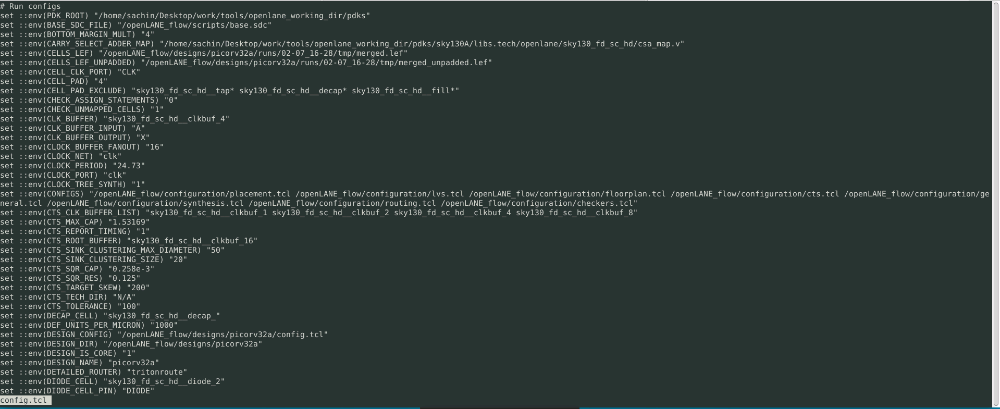

Advance Physical Design using OpenLANE and SkyWater 130nm PDK
=============================================================

This workshop consisted of using the **OpenLANE** flow and the **Skywater 130nm PDK** to take a `verilog` design to **GDSII** which can then be used to tap-out the design.

----------------------------------------------------------

Contents
--------

- *Day 1*
    - How to talk to computers
    - SoC design and OpenLANE
    - Starting RISC-V SoC Reference design
    - Get familiar to open-source EDA tools

-  *Day 2*
    - Chip Floor planning considerations
    - Library Binding and Placement
    - Cell design and characterization flows
    - General timing characterization parameters

- *Day 3*
    - Labs for CMOS inverter ngspice simulations
    - Inception of Layout – CMOS fabrication process
Sky130 Tech File Labs

- *Day 4*
    - Timing modelling using delay tables
    - Timing analysis with ideal clocks using openSTA
    - Clock tree synthesis TritonCTS and signal integrity
    - Timing analysis with real clocks using openSTA

- *Day 5*
    - Routing and design rule check (DRC)
    - PNR interactive flow tutorial

------------------------------------------------------------

DAY1 - Introduction to the requirements and the openlane flow
------------------------------------------------------------

------------------------------------------------------------

DAY2 - Introduction to floorplaning and considerations
------------------------------------------------------------

------------------------------------------------------------

DAY3 - Introduction to custom cells and sky130tech file
------------------------------------------------------------

 

------------------------------------------------------------

DAY4 - Integration of custom cell into picorv32a synthesis and **STA**
------------------------------------------------------------

------------------------------------------------------------

DAY5 - Introduction to routing and power grids
------------------------------------------------------------
[lee's algorithm](https://www.vlsisystemdesign.com/maze-routing-lees-algorithm/)

------------------------------------------------------------

Acknowledgements
----------------
1. Kunal Ghosh - Co-founder (VSD Corp)
2. Nickson Jose - Teaching Assistant
3. Mansi Mohapatra - Teaching Assistant
4. Mili Anand - Teaching Assistant